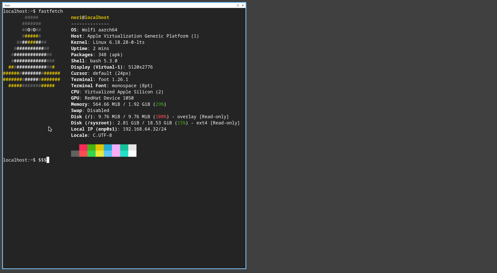

# wolfi-bootc

A bootable wolfi linux container.



The actual container image is assembled in [vaskozl/containers](https://github.com/vaskozl/containers/blob/main/bootc.yaml) — built completely declaratively with [apko](https://github.com/chainguard-dev/apko) from packages produced by [melange](https://github.com/chainguard-dev/melange). No `Dockerfile` is involved.

This repo just provides a `Justfile` for turning that image into a bootable disk image (or flashing it directly) and booting it in a VM.

## Usage

Build a bootable disk image from the published container:

```bash
just image
```

This produces a 20G `bootable.img` you can flash to a disk or boot in a VM.

On macOS, boot it headless with [vfkit](https://github.com/crc-org/vfkit) (serial console on stdio):

```bash
just vfkit
```

Or with a graphical window:

```bash
just vfkit-gui
```

Run an arbitrary `bootc` command against the image (e.g. to inspect or re-install):

```bash
just bootc status
```

The username and password is `nori`.
